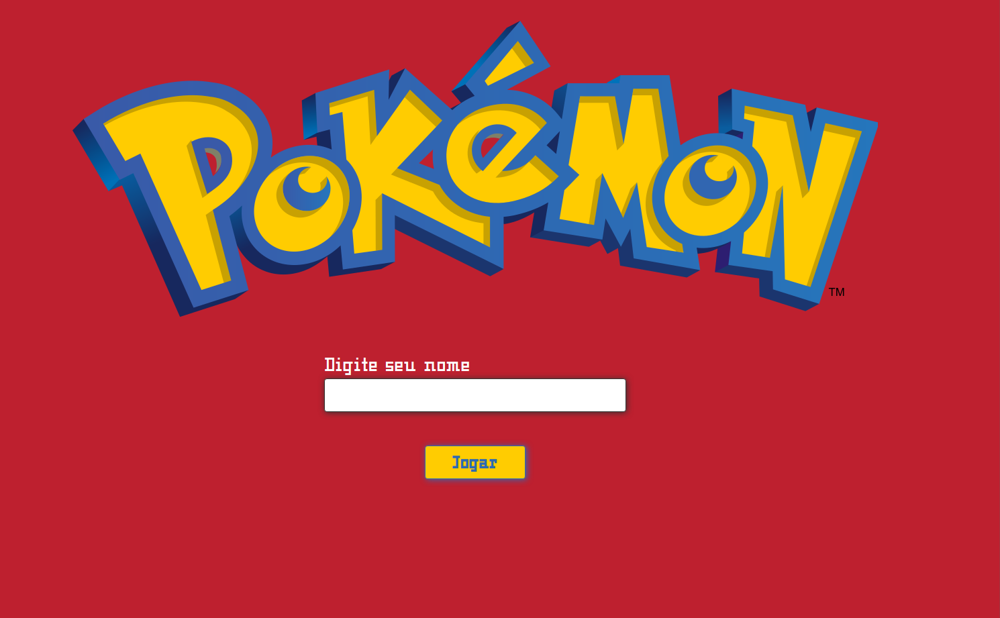
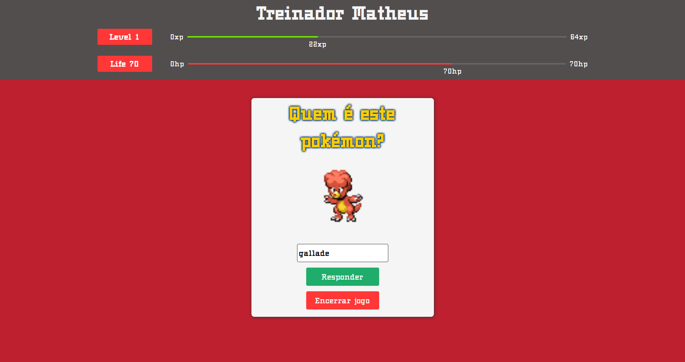

<h1 align="center">
  
</h1>

  <a href="#-tecnologias">Tecnologias</a>&nbsp;&nbsp;&nbsp;|&nbsp;&nbsp;&nbsp;
  <a href="#-projeto">Projeto</a>&nbsp;&nbsp;&nbsp;|&nbsp;&nbsp;&nbsp;
  <a href="#-layout">Layout</a>&nbsp;&nbsp;&nbsp;|&nbsp;&nbsp;&nbsp;
  <a href="#-como-executar">Como executar</a>&nbsp;&nbsp;&nbsp;|&nbsp;&nbsp;&nbsp;
  <a href="#-licença">Licença</a>

 

## ✨ Tecnologias

Esse projeto foi desenvolvido com a seguinte tecnologia:

- [React](https://reactjs.org)

## 💻 Projeto

Quem é esse pokémon é uma simulação de um minigame feito apenas para estudo, nele eu simulo um quiz de pokémons :D

## 🔖 Layout

<h1>Tela inicial</h1>

<h1>Tela do Game</h1>

<h1>Tela final</h1>

## 🚀 Como executar

- Acesse a demo no netlify mapx-game.netlify.app
- ou para executar localmente
- Clone o repositório
- Instale as dependências com `yarn`
- Inicie o servidor com `yarn start`

Agora você pode acessar [`localhost:3000`](http://localhost:3000) do seu navegador.

---

Feito com ♥ by Matheus 👋🏻 